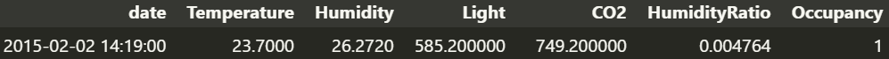

# Os dados processados são gerados automaticamente após a execução do script de preparação dos dados que se encontra em: `Code/DataPrep/data_prep.ipynb`.

## Exemplo de dados
_Imagem de exemplo dos dados que são capturados._

_Tipos dos dados de cada coluna_

| Coluna        | Tipo         |
|---------------|--------------|
| date          | object       |
| Temperature   | float64      |
| Humidity      | float64      |
| Light         | float64      |
| CO2           | float64      |
| HumidityRatio | float64      |
| Occupancy     | int64        |