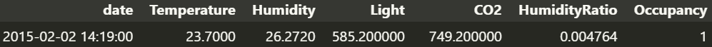

# Data Dictionary
Será utlizado um conjunto de dados que é fornecido por sensores que estão dentro de uma sala. Esses sensores capturam dados da sala que são enviados para a nuvem como: date (dia e horário da captura), Temperature (temperatura), Humidity (humidade), Light (luminosidade da sala), CO2 (nível de gás carbônico), HumidityRatio (taxa de umidade) e occupancy(ocupação).

## Exemplo de dados
_Imagem de exemplo dos dados que são capturados._

_Tipos dos dados de cada coluna_

| Coluna        | Tipo         |
|---------------|--------------|
| date          | object       |
| Temperature   | float64      |
| Humidity      | float64      |
| Light         | float64      |
| CO2           | float64      |
| HumidityRatio | float64      |
| Occupancy     | int64        |