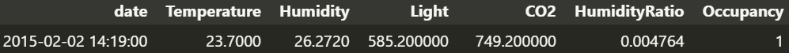

# Data Report
Será utlizado um conjunto de dados que é fornecido por sensores que estão dentro de uma sala. Esses sensores capturam dados da sala como: date (dia e horário da captura), Temperature (temperatura), Humidity (humidade), Light (luminosidade da sala), CO2 (nível de gás carbônico), HumidityRatio (taxa de umidade) e occupancy (ocupação) que é a variável alvo que será utilizada no modelo de predição.

## Exemplo de dados
_Imagem de exemplo dos dados que são capturados._

_Tipos dos dados de cada coluna_

| Coluna        | Tipo         | Descrição |
|---------------|--------------|-----------|
| date          | object       | Dia e horário da captura |
| Temperature   | float64      | Temperatura da sala |
| Humidity      | float64      | Humidade da sala |
| Light         | float64      | Luminosidade da sala |
| CO2           | float64      | Nível de gás carbônico |
| HumidityRatio | float64      | Taxa de umidade |
| Occupancy     | int64        | Ocupação da sala |