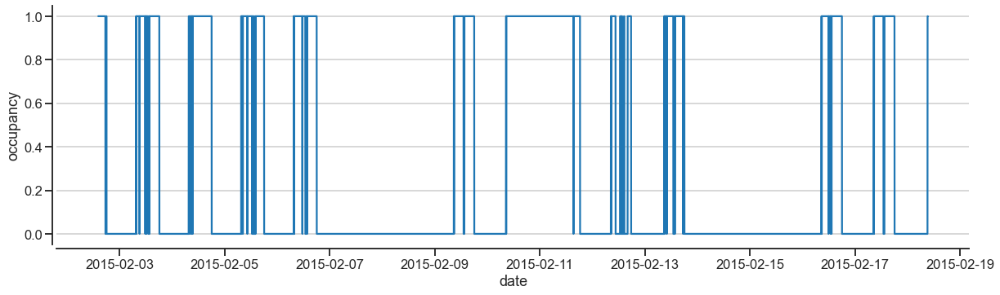
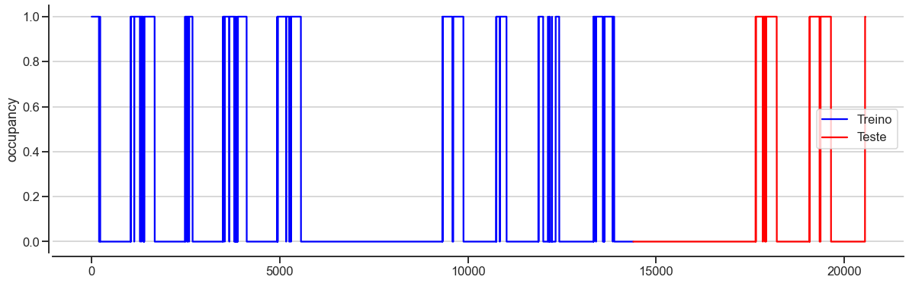
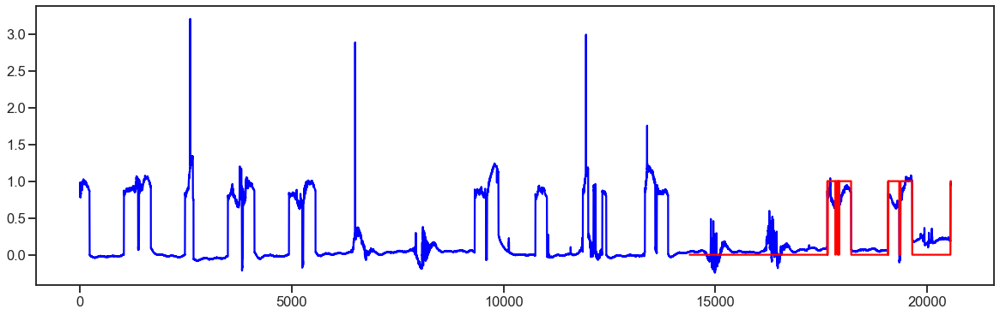

# Gráficos do modelo

## Gráfico do dado original:

## Gráfico do dado divido em treino (azul) e teste (vermelho):

# Gráfico comparando o resultado do modelo (azul) com o dados separados para o teste (vermelho):

