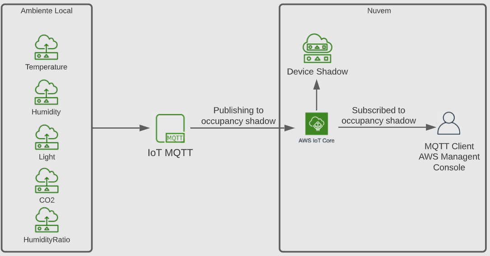

# Projeto de Bloco em IoT e Data Science

## Descrição rápida
* Projeto feito para a disciplina de IoT (Internet of Things) e Data Science com o objetivo de reduzir o custo de energia de uma empresa utilizando modelos inteligentes para prever se uma pessoa está ou não dentro de um ambiente para que seja feito o controle de temperatura e luminosidade.

## Escopo
* Criação de atuadores para a predição se há ou não alguém dentro da sala.

## Pessoas envolvidas
* Aluno - Paulo Silva de Oliveira
* Professor - Fernando Guimarães

## Plano
* Fazer a predição se há ou não alguém dentro da sala.

## Atualizações do projeto
* Após a criação do repositório, foi feito uma descrição rápida sobre o que será usado e as pessoas envolvidas no projeto.
* Criado um arquivo para fazer o pré-processamento dos dados, alterando nome de colunas, excluindo colunas que não serão usadas e linhas com valores inválidos.
* Criado um script para o upload dos dados para o ambiente AWS e atualização da documentação.
* Criado um modelo de predição utilizando o Facebook Prophet e atualização da documentação.
* Criado um arquivo para criação e atualização de Device Shadow e atualização da documentação.

## Arquitetura
* Serão utilizados os dados no formato CSV.
* Python para criação de scripts.
* Jupyter Notebook para uma melhor visualização dos dados e criação do modelo de predição.
* Facebook Prophet para o modelo de predição.
* AWS para os atuadores.

### Diagrama mostrando a comunicação que é feita quando é executado o arquivo `upload_aws.py`.

## Diagrama mostrando a comunicação que é feita quando é executado o arquivo `device_shadow.py`.
