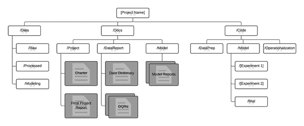

# Projeto de Bloco em IoT e Data Science

## Descrição
O objetivo do projeto é fazer um modelo de predição que possa dizer através de um conjunto de dados, se uma sala está ou não ocupada.

## Estrutura do repositório
A estrutura do projeto é baseada no template da Azure TDSP (Processo de Ciência de Dados de Equipe) que é uma metodologia de ciência de dados ágil e iterativa que fornece com eficiência soluções de análise preditiva e de aplicativos inteligentes.

## Fazer upload dos arquivos para AWS IoT
* Necessário ter o [python](https://www.python.org/downloads/) instalado juntamente com o [Jupyter Notebook](https://docs.jupyter.org/en/latest/install.html) para facilitar a visualização dos dados e gráficos.
* Para rodar o projeto primeiramente é necessário rodar o script `data_prep.ipynb` que se encontra em: `Code/DataPrep/data_prep.ipynb` para que ele possa fazer as preparações dos dados.
* Para fazer o upload dos dados para a AWS é necessário rodar o script `upload_aws.py` que se encontra em: `Code/Operationalization/upload_aws.py`.

## Criação e execução do modelo de predição
* Necessário ter o [python](https://www.python.org/downloads/) instalado juntamente com o [Jupyter Notebook](https://docs.jupyter.org/en/latest/install.html) para facilitar a visualização dos dados e gráficos.
* Primeiramente é necessário fazer os procedimentos contidos no arquivo `README.md` na pasta `Data/Modeling`, para que obtenha os dados que serão utilizados no modelo.
* Após adiquirir os dados, basta rodar o script `facebook_prophet.ipynb` contido na pasta `Code/Model/`.

## Criando um Device Shadow
* Necessário ter o [python](https://www.python.org/downloads/) instalado juntamente com o [Jupyter Notebook](https://docs.jupyter.org/en/latest/install.html) para facilitar a visualização dos dados e gráficos.
* É necessário fazer os procedimentos contidos no arquivo ReadMe.md na pasta `Data/Modeling`.
* Após colocar os dados que será utilizado para o modelo na pasta `Data/Modeling`, basta rodar o script `device_shadow.py` localizado em `Code/Operationalization/`.